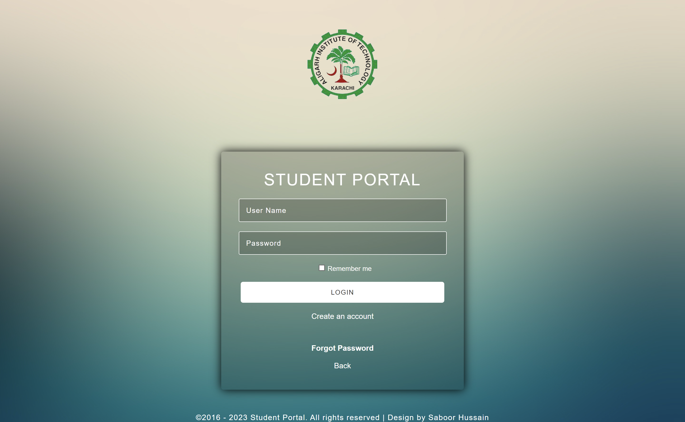
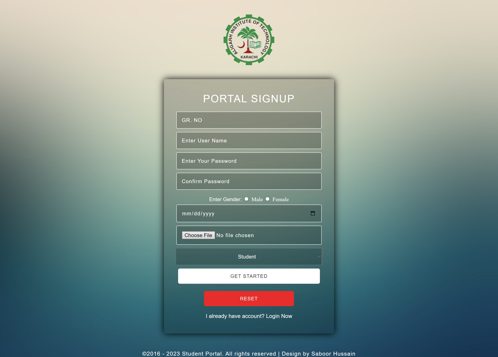

# SmartCampus

SmartCampus is an educational website designed to enhance the learning experience for students. The website offers a range of features to streamline access to educational resources and facilitate interaction within the campus community.

## Table of Contents

- [Features](#features)
- [Languages Used](#languages-used)
- [Screenshots](#screenshots)
- [Getting Started](#getting-started)
- [Contributions](#contributions)
- [License](#license)

## Features

SmartCampus provides the following key features:

1. **Homepage:** A welcoming landing page that introduces visitors to the platform and its offerings.

2. **Login Page:** Secure user authentication for accessing personalized content and features.

3. **Signup Page:** User-friendly registration process to create new accounts.

4. **User Dashboard:** A personalized dashboard for each user, providing access to courses, assignments, announcements, and more.

## Languages Used

The SmartCampus project incorporates a combination of technologies to deliver a seamless experience:

- **HTML5:** A markup language used to structure content on the web.
- **CSS3:** A style sheet language that enhances the visual design and layout.
- **JSP (JavaServer Pages):** A technology for creating dynamic web content using Java.
- **MySQL:** A popular open-source relational database management system.

## Screenshots

Below are screenshots of the different pages within the SmartCampus website:

### Homepage


### Login Page


### Signup Page


### User Dashboard


## Getting Started

To explore and run the SmartCampus project locally, follow these steps:

1. Clone this repository to your local machine using:

   ```bash
   git clone https://github.com/Saboor-Hussain/SmartCampus.git
   ```

2. Navigate to the project directory:

   ```bash
   cd SmartCampus
   ```

3. Open the project files using your preferred code editor.

4. Launch the project in a web browser to interact with its features.


## License

This project is licensed under the MIT License. You are free to modify and distribute the code, subject to the terms of the license.
